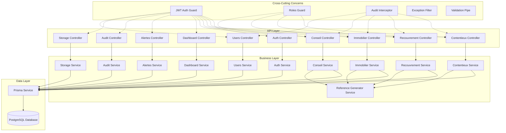
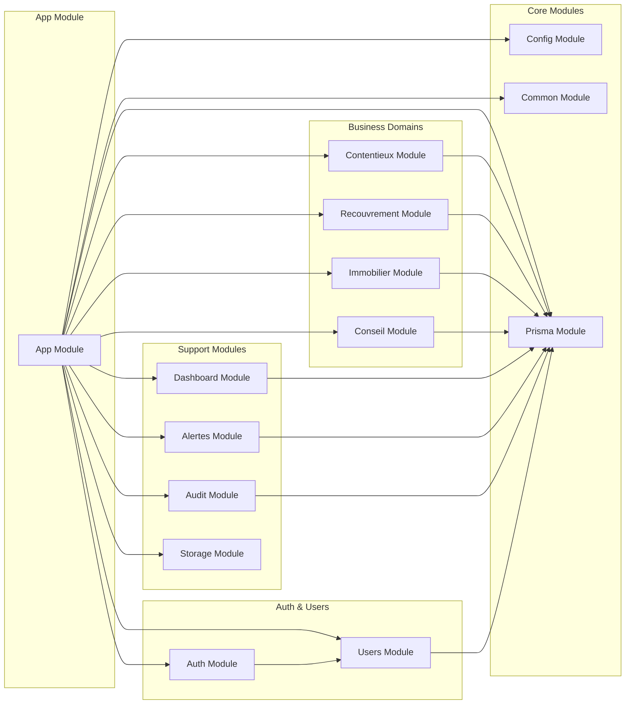

# Document de Conception - Architecture NestJS API CAPCO

## Vue d'Ensemble

L'API CAPCO est conçue comme une application NestJS modulaire suivant les principes de Domain-Driven Design (DDD) et Clean Architecture. L'architecture sépare clairement les préoccupations métier par domaine (contentieux, recouvrement, immobilier, conseil) tout en fournissant des services transversaux partagés (authentification, audit, validation).

L'application utilise TypeScript pour la sécurité des types, Prisma comme ORM pour l'accès aux données PostgreSQL, et JWT pour l'authentification. Un système d'audit automatique trace toutes les actions utilisateur, et la validation des données est assurée par des DTOs avec class-validator.

## Architecture

### Architecture Globale



### Structure des Modules



## Composants et Interfaces

### 1. Module d'Authentification

**AuthModule** : Gère l'authentification JWT et les stratégies de sécurité.

```typescript
// Interfaces principales
interface AuthService {
  login(credentials: LoginDto): Promise<AuthResponse>
  validateUser(email: string, password: string): Promise<User | null>
  generateTokens(user: User): Promise<TokenPair>
  refreshToken(refreshToken: string): Promise<AuthResponse>
}

interface JwtPayload {
  sub: string
  email: string
  roles: AppRole[]
  iat: number
  exp: number
}

interface AuthResponse {
  user: UserResponseDto
  accessToken: string
  refreshToken: string
}
```

**Composants** :
- `AuthController` : Endpoints de connexion, déconnexion, refresh token
- `AuthService` : Logique d'authentification et génération de tokens
- `JwtStrategy` : Stratégie Passport pour validation JWT
- `LocalStrategy` : Stratégie Passport pour authentification locale
- `JwtAuthGuard` : Guard pour protection des endpoints
- `RolesGuard` : Guard pour vérification des rôles

### 2. Module Utilisateurs

**UsersModule** : Gestion des utilisateurs et de leurs rôles.

```typescript
interface UsersService {
  create(createUserDto: CreateUserDto): Promise<User>
  findAll(query: UsersQueryDto): Promise<PaginatedResponse<User>>
  findOne(id: string): Promise<User>
  update(id: string, updateUserDto: UpdateUserDto): Promise<User>
  remove(id: string): Promise<void>
  assignRole(userId: string, role: AppRole): Promise<void>
  removeRole(userId: string, role: AppRole): Promise<void>
}
```

### 3. Modules Métier

Chaque domaine métier suit la même structure :

```typescript
// Structure générique pour les modules métier
interface DomainService<T, CreateDto, UpdateDto, QueryDto> {
  create(createDto: CreateDto): Promise<T>
  findAll(query: QueryDto): Promise<PaginatedResponse<T>>
  findOne(id: string): Promise<T>
  update(id: string, updateDto: UpdateDto): Promise<T>
  remove(id: string): Promise<void>
}
```

**ContentieuxModule** :
- Gestion des affaires, audiences, honoraires et dépenses contentieux
- Services : `AffairesService`, `AudiencesService`, `HonorairesContentieuxService`, `DepensesAffairesService`

**RecouvrementModule** :
- Gestion des dossiers de recouvrement, actions, paiements et honoraires
- Services : `DossiersRecouvrementService`, `ActionsRecouvrementService`, `PaiementsRecouvrementService`, `HonorairesRecouvrementService`

**ImmobilierModule** :
- Gestion complète du patrimoine immobilier
- Services : `ProprietairesService`, `ImmeublesService`, `LotsService`, `LocatairesService`, `BauxService`, `EncaissementsService`, `RapportsGestionService`

**ConseilModule** :
- Gestion des clients conseil, tâches et facturation
- Services : `ClientsConseilService`, `TachesConseilService`, `FacturesConseilService`, `PaiementsConseilService`

### 4. Services Transversaux

**ReferenceGeneratorService** : Génération automatique de références métier.

```typescript
interface ReferenceGeneratorService {
  generateAffaireReference(): Promise<string>
  generateDossierRecouvrementReference(): Promise<string>
  generateClientConseilReference(): Promise<string>
  generateFactureReference(clientId: string): Promise<string>
  generateRapportGestionReference(immeubleId: string): Promise<string>
}
```

**AuditService** : Gestion des logs d'audit.

```typescript
interface AuditService {
  log(entry: CreateAuditLogDto): Promise<void>
  findAll(query: AuditQueryDto): Promise<PaginatedResponse<AuditLog>>
  findByUser(userId: string, query: AuditQueryDto): Promise<PaginatedResponse<AuditLog>>
  findByModule(module: string, query: AuditQueryDto): Promise<PaginatedResponse<AuditLog>>
}
```

**DashboardService** : Agrégation de données pour le tableau de bord.

```typescript
interface DashboardService {
  getOverview(): Promise<DashboardOverviewDto>
  getContentieuxStats(): Promise<ContentieuxStatsDto>
  getRecouvrementStats(): Promise<RecouvrementStatsDto>
  getImmobilierStats(): Promise<ImmobilierStatsDto>
  getConseilStats(): Promise<ConseilStatsDto>
}
```

### 5. Module Common

Contient les éléments partagés :

**Guards** :
- `JwtAuthGuard` : Vérification des tokens JWT
- `RolesGuard` : Vérification des rôles utilisateur

**Interceptors** :
- `AuditLogInterceptor` : Audit automatique des actions
- `TransformInterceptor` : Transformation des réponses

**Pipes** :
- `ValidationPipe` : Validation des DTOs
- `ParseUUIDPipe` : Validation des UUIDs

**Filters** :
- `AllExceptionsFilter` : Gestion globale des erreurs
- `PrismaExceptionFilter` : Gestion spécifique des erreurs Prisma

**Decorators** :
- `@Roles()` : Décorateur pour spécifier les rôles requis
- `@CurrentUser()` : Décorateur pour récupérer l'utilisateur courant
- `@AuditLog()` : Décorateur pour personnaliser l'audit

## Modèles de Données

### DTOs de Base

```typescript
// DTOs communs
class PaginationDto {
  @IsOptional()
  @Type(() => Number)
  @IsInt()
  @Min(1)
  page?: number = 1

  @IsOptional()
  @Type(() => Number)
  @IsInt()
  @Min(1)
  @Max(100)
  limit?: number = 10

  @IsOptional()
  @IsString()
  search?: string

  @IsOptional()
  @IsString()
  sortBy?: string

  @IsOptional()
  @IsEnum(['asc', 'desc'])
  sortOrder?: 'asc' | 'desc' = 'desc'
}

class PaginatedResponse<T> {
  data: T[]
  meta: {
    total: number
    page: number
    limit: number
    totalPages: number
    hasNext: boolean
    hasPrev: boolean
  }
}
```

### DTOs Métier

Chaque entité dispose de DTOs spécialisés :

```typescript
// Exemple pour les Affaires
class CreateAffaireDto {
  @IsString()
  @IsNotEmpty()
  intitule: string

  @IsArray()
  @ValidateNested({ each: true })
  @Type(() => PartieDto)
  demandeurs: PartieDto[]

  @IsArray()
  @ValidateNested({ each: true })
  @Type(() => PartieDto)
  defendeurs: PartieDto[]

  @IsString()
  @IsNotEmpty()
  juridiction: string

  @IsString()
  @IsNotEmpty()
  chambre: string

  @IsOptional()
  @IsString()
  notes?: string
}

class UpdateAffaireDto extends PartialType(CreateAffaireDto) {
  @IsOptional()
  @IsEnum(StatutAffaire)
  statut?: StatutAffaire
}

class AffaireResponseDto {
  id: string
  reference: string
  intitule: string
  demandeurs: any[]
  defendeurs: any[]
  juridiction: string
  chambre: string
  statut: StatutAffaire
  notes?: string
  createdAt: Date
  updatedAt: Date
  createdBy: string
}
```

### Validation et Transformation

Utilisation de `class-validator` et `class-transformer` pour :
- Validation automatique des données d'entrée
- Transformation des types (string vers number, etc.)
- Sanitisation des données
- Messages d'erreur personnalisés

## Propriétés de Correction

*Une propriété est une caractéristique ou un comportement qui doit être vrai pour toutes les exécutions valides d'un système - essentiellement, une déclaration formelle sur ce que le système devrait faire. Les propriétés servent de pont entre les spécifications lisibles par l'homme et les garanties de correction vérifiables par machine.*

Basé sur l'analyse des critères d'acceptation, voici les propriétés de correction qui valident le comportement universel du système :

### Propriété 1: Cohérence de la structure modulaire
*Pour tout* module métier créé, il doit contenir les fichiers controller, service et DTO correspondants avec les conventions de nommage appropriées
**Valide: Exigences 1.2**

### Propriété 2: Injection de dépendances modulaire
*Pour tout* module importé, les dépendances doivent être correctement résolues et les limites de module maintenues
**Valide: Exigences 1.5**

### Propriété 3: Authentification JWT round-trip
*Pour tout* utilisateur valide, générer un token JWT puis le valider doit retourner les mêmes informations utilisateur
**Valide: Exigences 2.1, 2.2**

### Propriété 4: Protection des endpoints par rôles
*Pour tout* endpoint protégé et tout token JWT, l'accès doit être accordé si et seulement si le token est valide et contient les rôles requis
**Valide: Exigences 2.4, 2.5**

### Propriété 5: Audit automatique des actions
*Pour toute* opération CRUD effectuée par un utilisateur authentifié, une entrée d'audit correspondante doit être créée automatiquement avec toutes les informations requises
**Valide: Exigences 3.1, 3.2, 3.3**

### Propriété 6: Génération automatique de références d'audit
*Pour toute* entité créée, une référence unique doit être générée automatiquement et incluse dans le log d'audit
**Valide: Exigences 3.4**

### Propriété 7: Application globale de l'audit
*Pour tout* endpoint protégé, l'intercepteur d'audit doit être appliqué automatiquement
**Valide: Exigences 3.5**

### Propriété 8: Validation des données d'entrée
*Pour toute* donnée invalide envoyée à un endpoint, le système doit retourner des erreurs de validation structurées avec des détails spécifiques aux champs
**Valide: Exigences 4.2, 4.4**

### Propriété 9: Transformation automatique des données
*Pour toute* donnée nécessitant une transformation, elle doit être automatiquement transformée et nettoyée selon les règles définies
**Valide: Exigences 4.5**

### Propriété 10: Endpoints CRUD complets par domaine
*Pour tout* domaine métier (contentieux, recouvrement, immobilier, conseil), tous les endpoints CRUD requis doivent être implémentés pour chaque entité du domaine
**Valide: Exigences 5.1, 5.2, 5.3, 5.4**

### Propriété 11: Cohérence des réponses API
*Pour tout* endpoint appelé, la réponse doit suivre un format JSON cohérent avec des codes de statut HTTP appropriés
**Valide: Exigences 5.6**

### Propriété 12: Unicité globale des références
*Pour toute* entité créée nécessitant une référence, celle-ci doit être unique dans tout le système et suivre le format spécifique au domaine
**Valide: Exigences 6.2, 6.3, 6.4**

### Propriété 13: Génération atomique des références
*Pour toute* génération de référence effectuée de manière concurrente, aucun doublon ne doit être créé
**Valide: Exigences 6.5**

### Propriété 14: Gestion cohérente des erreurs
*Pour toute* erreur survenant dans le système, une réponse structurée avec code d'erreur et message doit être retournée
**Valide: Exigences 7.2**

### Propriété 15: Transformation des erreurs Prisma
*Pour toute* erreur de base de données Prisma, elle doit être transformée en message convivial pour l'utilisateur
**Valide: Exigences 7.3**

### Propriété 16: Protection des informations sensibles dans les logs
*Pour toute* erreur loggée, les informations sensibles doivent être filtrées ou masquées
**Valide: Exigences 7.4**

### Propriété 17: Niveaux d'erreur par environnement
*Pour toute* erreur dans différents environnements, le niveau de détail doit être approprié à l'environnement (plus de détails en développement)
**Valide: Exigences 7.5**

### Propriété 18: Chargement de configuration au démarrage
*Pour tout* démarrage d'application, la configuration doit être chargée depuis les variables d'environnement et validée
**Valide: Exigences 8.2, 8.3**

### Propriété 19: Sécurisation des valeurs de configuration
*Pour toute* valeur de configuration sensible, elle ne doit pas être exposée dans les logs ou messages d'erreur
**Valide: Exigences 8.5**

### Propriété 20: Opérations de base de données type-safe
*Pour toute* opération de base de données, elle doit utiliser Prisma Client pour maintenir la sécurité des types
**Valide: Exigences 9.2**

### Propriété 21: Gestion transactionnelle des opérations complexes
*Pour toute* opération complexe impliquant plusieurs entités, elle doit être correctement encapsulée dans une transaction
**Valide: Exigences 9.4**

### Propriété 22: Documentation complète des endpoints
*Pour tout* endpoint défini, il doit avoir une documentation complète des paramètres et réponses dans Swagger
**Valide: Exigences 10.2**

### Propriété 23: Exemples de documentation
*Pour tout* endpoint, des exemples de requêtes et réponses doivent être fournis dans la documentation
**Valide: Exigences 10.3**

### Propriété 24: Documentation de sécurité
*Pour tout* endpoint, les exigences d'authentification et permissions de rôles doivent être documentées
**Valide: Exigences 10.4**

### Propriété 25: Cohérence du versioning API
*Pour toute* modification d'API, les politiques de versioning et de dépréciation doivent être respectées de manière cohérente
**Valide: Exigences 10.5**

## Gestion des Erreurs

### Stratégie de Gestion des Erreurs

L'API implémente une stratégie de gestion d'erreurs en couches :

1. **Validation des DTOs** : Erreurs de validation capturées par `ValidationPipe`
2. **Erreurs Métier** : Exceptions personnalisées pour la logique métier
3. **Erreurs Prisma** : Transformation des erreurs de base de données
4. **Erreurs Système** : Gestion des erreurs inattendues

### Types d'Erreurs

```typescript
// Structure standard des erreurs
interface ErrorResponse {
  statusCode: number
  message: string | string[]
  error: string
  timestamp: string
  path: string
  details?: any
}

// Erreurs personnalisées
class BusinessException extends HttpException {
  constructor(message: string, statusCode: HttpStatus = HttpStatus.BAD_REQUEST) {
    super(message, statusCode)
  }
}

class EntityNotFoundException extends BusinessException {
  constructor(entityName: string, id: string) {
    super(`${entityName} with ID ${id} not found`, HttpStatus.NOT_FOUND)
  }
}
```

### Filtres d'Exception

```typescript
@Catch()
export class AllExceptionsFilter implements ExceptionFilter {
  catch(exception: unknown, host: ArgumentsHost) {
    // Gestion différenciée selon le type d'exception
    // Logging approprié selon l'environnement
    // Masquage des informations sensibles
  }
}

@Catch(PrismaClientKnownRequestError)
export class PrismaExceptionFilter implements ExceptionFilter {
  catch(exception: PrismaClientKnownRequestError, host: ArgumentsHost) {
    // Transformation des erreurs Prisma en messages utilisateur
    // Gestion des contraintes de base de données
  }
}
```

## Stratégie de Test

### Approche de Test Dual

L'API utilise une approche de test combinant tests unitaires et tests basés sur les propriétés :

**Tests Unitaires** :
- Validation des exemples spécifiques et cas limites
- Tests d'intégration entre composants
- Vérification des conditions d'erreur
- Tests de configuration et de démarrage

**Tests Basés sur les Propriétés** :
- Validation des propriétés universelles sur de nombreuses entrées
- Tests de cohérence et d'invariants
- Validation des transformations et round-trips
- Tests de concurrence et de performance

### Configuration des Tests de Propriétés

**Bibliothèque** : `fast-check` pour TypeScript/JavaScript
**Configuration** : Minimum 100 itérations par test de propriété
**Étiquetage** : Chaque test de propriété doit référencer sa propriété de conception

Format d'étiquetage : **Feature: nestjs-api-architecture, Property {number}: {property_text}**

### Exemples de Tests

```typescript
// Test de propriété pour l'authentification JWT
describe('Property 3: JWT Authentication Round-trip', () => {
  it('should maintain user information through token generation and validation', 
    async () => {
      await fc.assert(fc.asyncProperty(
        fc.record({
          email: fc.emailAddress(),
          roles: fc.array(fc.constantFrom('admin', 'collaborateur', 'compta'), { minLength: 1 })
        }),
        async (userData) => {
          // Feature: nestjs-api-architecture, Property 3: JWT round-trip consistency
          const user = await createTestUser(userData)
          const token = await authService.generateTokens(user)
          const validatedUser = await authService.validateToken(token.accessToken)
          
          expect(validatedUser.email).toBe(user.email)
          expect(validatedUser.roles).toEqual(user.roles)
        }
      ), { numRuns: 100 })
    }
  )
})

// Test unitaire pour cas spécifique
describe('Auth Service', () => {
  it('should reject invalid credentials', async () => {
    const result = await authService.validateUser('invalid@email.com', 'wrongpassword')
    expect(result).toBeNull()
  })
})
```

### Couverture de Test

- **Tests de Propriétés** : Couvrent les 25 propriétés de correction définies
- **Tests Unitaires** : Couvrent les cas limites, exemples spécifiques et intégrations
- **Tests d'Intégration** : Valident les flux end-to-end et l'interaction entre modules
- **Tests de Performance** : Vérifient les temps de réponse et la gestion de charge

L'objectif est d'atteindre une couverture de code supérieure à 90% tout en maintenant des tests significatifs qui valident le comportement métier réel.