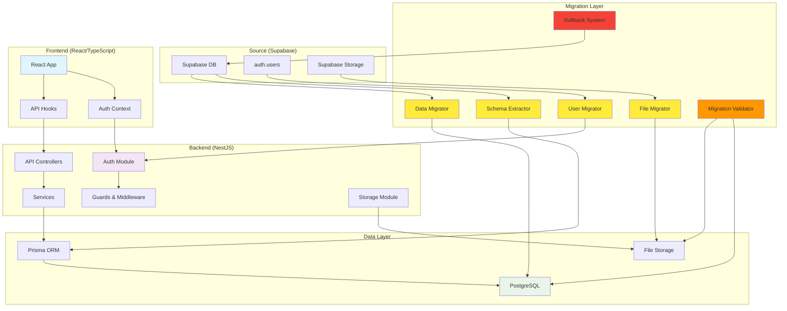
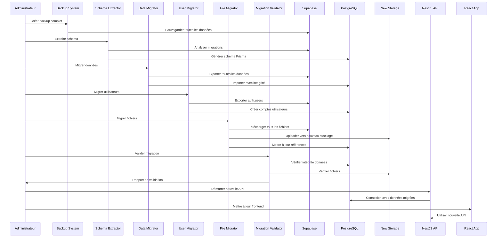

# Design Document - Migration Supabase vers NestJS

## Overview

Cette migration transforme une application React/TypeScript utilisant Supabase en une architecture découplée avec un backend NestJS personnalisé et PostgreSQL. La migration complète de niveau entreprise inclut la migration de TOUTES les données utilisateur réelles de production, la migration complète des utilisateurs depuis auth.users avec préservation des identités, la migration de TOUS les fichiers stockés avec validation d'intégrité, et des garanties de sécurité de niveau production avec capacité de rollback complète à tout moment. L'objectif est de créer un système de production robuste avec préservation complète des données existantes et des fonctionnalités avancées de migration d'entreprise.

**CRITIQUE** : Cette migration concerne des DONNÉES UTILISATEUR RÉELLES en production. Le système de migration inclut :
- Sauvegarde complète avant migration avec validation de restauration
- Migration incrémentale avec points de contrôle granulaires
- Validation d'intégrité en temps réel à chaque étape
- Capacité de rollback complet à tout moment avec restauration automatique
- Audit trail complet de toutes les opérations avec traçabilité forensique
- Tests de validation post-migration avec métriques de confiance
- Monitoring en temps réel du processus avec alertes automatiques
- Système de retry automatique avec escalade manuelle

### Architecture Actuelle
- Frontend: React/TypeScript avec @supabase/supabase-js
- Backend: Supabase (BaaS) avec **DONNÉES UTILISATEUR RÉELLES DE PRODUCTION CRITIQUES**
- Base de données: PostgreSQL hébergé par Supabase avec **DONNÉES DE PRODUCTION CRITIQUES** (affaires, dossiers, clients, finances)
- Authentification: supabase.auth avec **UTILISATEURS EXISTANTS RÉELS** et historique d'authentification
- Storage: supabase.storage avec **FICHIERS UTILISATEUR EXISTANTS RÉELS** (documents légaux, pièces jointes, rapports)

### Architecture Cible
- Frontend: React/TypeScript avec axios/fetch
- Backend: NestJS avec TypeScript
- Base de données: PostgreSQL avec **TOUTES LES DONNÉES MIGRÉES INTÉGRALEMENT** via Prisma ORM
- Authentification: JWT avec bcrypt et **MIGRATION COMPLÈTE DES UTILISATEURS EXISTANTS** avec préservation des identités
- Storage: Multer avec stockage local ou S3 et **MIGRATION DE TOUS LES FICHIERS EXISTANTS** avec validation d'intégrité
- Migration: Système complet de migration avec rollback, validation d'intégrité, et garanties de production

## Architecture

### Diagramme d'Architecture



### Flux de Migration Complète



## Components and Interfaces

### 1. Migration System Components

#### Data Migrator

```typescript
@Injectable()
export class DataMigrator {
  constructor(
    private supabaseClient: SupabaseClient,
    private prisma: PrismaService,
    private logger: Logger,
  ) {}

  async exportAllData(): Promise<MigrationData> {
    const tables = await this.getPublicTables();
    const data: MigrationData = {};
    
    for (const table of tables) {
      this.logger.log(`Exporting table: ${table}`);
      const records = await this.supabaseClient
        .from(table)
        .select('*')
        .order('created_at', { ascending: true });
      
      if (records.error) {
        throw new Error(`Failed to export ${table}: ${records.error.message}`);
      }
      
      data[table] = records.data;
      this.logger.log(`Exported ${records.data.length} records from ${table}`);
    }
    
    return data;
  }

  async importAllData(data: MigrationData): Promise<MigrationReport> {
    const report: MigrationReport = {
      totalTables: Object.keys(data).length,
      successfulTables: 0,
      failedTables: [],
      totalRecords: 0,
      importedRecords: 0,
    };

    // Import in dependency order to maintain referential integrity
    const importOrder = this.getImportOrder();
    
    for (const tableName of importOrder) {
      if (!data[tableName]) continue;
      
      try {
        await this.importTableData(tableName, data[tableName]);
        report.successfulTables++;
        report.importedRecords += data[tableName].length;
      } catch (error) {
        report.failedTables.push({
          table: tableName,
          error: error.message,
          recordCount: data[tableName].length,
        });
      }
      
      report.totalRecords += data[tableName].length;
    }
    
    return report;
  }

  private async importTableData(tableName: string, records: any[]): Promise<void> {
    // Use Prisma raw queries to preserve UUIDs and handle conflicts
    const chunks = this.chunkArray(records, 100);
    
    for (const chunk of chunks) {
      await this.prisma.$transaction(async (tx) => {
        for (const record of chunk) {
          await tx.$executeRawUnsafe(
            this.generateInsertQuery(tableName, record)
          );
        }
      });
    }
  }
}
```

#### User Migrator

```typescript
@Injectable()
export class UserMigrator {
  constructor(
    private supabaseClient: SupabaseClient,
    private prisma: PrismaService,
    private authService: AuthService,
    private logger: Logger,
  ) {}

  async migrateUsers(): Promise<UserMigrationReport> {
    // Export users from auth.users
    const { data: authUsers, error } = await this.supabaseClient.auth.admin.listUsers();
    
    if (error) {
      throw new Error(`Failed to export users: ${error.message}`);
    }

    const report: UserMigrationReport = {
      totalUsers: authUsers.users.length,
      migratedUsers: 0,
      failedUsers: [],
      passwordResetRequired: [],
    };

    for (const authUser of authUsers.users) {
      try {
        await this.migrateUser(authUser);
        report.migratedUsers++;
      } catch (error) {
        report.failedUsers.push({
          userId: authUser.id,
          email: authUser.email,
          error: error.message,
        });
      }
    }

    return report;
  }

  private async migrateUser(authUser: any): Promise<void> {
    // Create user in new system
    const newUser = await this.prisma.user.create({
      data: {
        id: authUser.id, // Preserve UUID
        email: authUser.email,
        password: await this.generateTemporaryPassword(),
        createdAt: new Date(authUser.created_at),
        updatedAt: new Date(authUser.updated_at),
        emailVerified: authUser.email_confirmed_at ? true : false,
        lastSignIn: authUser.last_sign_in_at ? new Date(authUser.last_sign_in_at) : null,
      },
    });

    // Migrate user roles from metadata or existing role tables
    await this.migrateUserRoles(authUser, newUser.id);
    
    // Send password reset email
    await this.authService.sendPasswordResetEmail(authUser.email);
  }

  private async generateTemporaryPassword(): Promise<string> {
    // Generate secure temporary password hash
    const tempPassword = crypto.randomBytes(32).toString('hex');
    return bcrypt.hash(tempPassword, 12);
  }
}
```

#### File Migrator

```typescript
@Injectable()
export class FileMigrator {
  constructor(
    private supabaseClient: SupabaseClient,
    private storageService: StorageService,
    private prisma: PrismaService,
    private logger: Logger,
  ) {}

  async migrateAllFiles(): Promise<FileMigrationReport> {
    const buckets = await this.listAllBuckets();
    const report: FileMigrationReport = {
      totalBuckets: buckets.length,
      totalFiles: 0,
      migratedFiles: 0,
      failedFiles: [],
      totalSize: 0,
      migratedSize: 0,
    };

    for (const bucket of buckets) {
      const bucketReport = await this.migrateBucket(bucket);
      report.totalFiles += bucketReport.totalFiles;
      report.migratedFiles += bucketReport.migratedFiles;
      report.failedFiles.push(...bucketReport.failedFiles);
      report.totalSize += bucketReport.totalSize;
      report.migratedSize += bucketReport.migratedSize;
    }

    return report;
  }

  private async migrateBucket(bucketName: string): Promise<BucketMigrationReport> {
    const files = await this.listBucketFiles(bucketName);
    const report: BucketMigrationReport = {
      bucketName,
      totalFiles: files.length,
      migratedFiles: 0,
      failedFiles: [],
      totalSize: 0,
      migratedSize: 0,
    };

    for (const file of files) {
      try {
        await this.migrateFile(bucketName, file);
        report.migratedFiles++;
        report.migratedSize += file.metadata.size;
      } catch (error) {
        report.failedFiles.push({
          fileName: file.name,
          path: file.path,
          error: error.message,
          size: file.metadata.size,
        });
      }
      
      report.totalSize += file.metadata.size;
    }

    return report;
  }

  private async migrateFile(bucketName: string, file: any): Promise<void> {
    // Download file from Supabase Storage
    const { data: fileData, error } = await this.supabaseClient.storage
      .from(bucketName)
      .download(file.name);

    if (error) {
      throw new Error(`Failed to download file: ${error.message}`);
    }

    // Upload to new storage system
    const buffer = await fileData.arrayBuffer();
    const uploadResult = await this.storageService.uploadMigratedFile({
      buffer: Buffer.from(buffer),
      originalName: file.name,
      mimetype: file.metadata.mimetype,
      size: file.metadata.size,
      bucketName,
      originalPath: file.path,
    });

    // Update database references
    await this.updateFileReferences(file.path, uploadResult.newPath);
  }

  private async updateFileReferences(oldPath: string, newPath: string): Promise<void> {
    // Update all database tables that reference this file
    const tables = await this.getTablesWithFileReferences();
    
    for (const table of tables) {
      await this.prisma.$executeRawUnsafe(`
        UPDATE ${table.name} 
        SET ${table.column} = REPLACE(${table.column}, $1, $2)
        WHERE ${table.column} LIKE $3
      `, oldPath, newPath, `%${oldPath}%`);
    }
  }
}
```

#### Migration Validator

```typescript
@Injectable()
export class MigrationValidator {
  constructor(
    private supabaseClient: SupabaseClient,
    private prisma: PrismaService,
    private storageService: StorageService,
    private logger: Logger,
  ) {}

  async validateMigration(): Promise<ValidationReport> {
    const report: ValidationReport = {
      dataValidation: await this.validateDataIntegrity(),
      userValidation: await this.validateUserMigration(),
      fileValidation: await this.validateFileMigration(),
      overallStatus: 'pending',
    };

    report.overallStatus = this.determineOverallStatus(report);
    return report;
  }

  private async validateDataIntegrity(): Promise<DataValidationResult> {
    const tables = await this.getPublicTables();
    const result: DataValidationResult = {
      totalTables: tables.length,
      validatedTables: 0,
      discrepancies: [],
    };

    for (const table of tables) {
      const sourceCount = await this.getSupabaseTableCount(table);
      const targetCount = await this.getPrismaTableCount(table);
      
      if (sourceCount !== targetCount) {
        result.discrepancies.push({
          table,
          sourceCount,
          targetCount,
          difference: Math.abs(sourceCount - targetCount),
        });
      } else {
        result.validatedTables++;
      }
    }

    return result;
  }

  private async validateUserMigration(): Promise<UserValidationResult> {
    const { data: authUsers } = await this.supabaseClient.auth.admin.listUsers();
    const migratedUsers = await this.prisma.user.count();
    
    return {
      sourceUserCount: authUsers.users.length,
      targetUserCount: migratedUsers,
      canAuthenticate: await this.testUserAuthentication(),
      rolesPreserved: await this.validateUserRoles(),
    };
  }

  private async validateFileMigration(): Promise<FileValidationResult> {
    const sourceFiles = await this.countSupabaseFiles();
    const targetFiles = await this.prisma.file.count();
    
    return {
      sourceFileCount: sourceFiles.count,
      targetFileCount: targetFiles,
      totalSourceSize: sourceFiles.totalSize,
      totalTargetSize: await this.calculateMigratedFileSize(),
      checksumValidation: await this.validateFileChecksums(),
    };
  }
}
```

#### Rollback System

```typescript
@Injectable()
export class RollbackSystem {
  constructor(
    private prisma: PrismaService,
    private storageService: StorageService,
    private backupService: BackupService,
    private logger: Logger,
  ) {}

  async createMigrationCheckpoint(checkpointName: string): Promise<CheckpointInfo> {
    const checkpoint: CheckpointInfo = {
      name: checkpointName,
      timestamp: new Date(),
      databaseBackup: await this.backupService.createDatabaseBackup(),
      storageBackup: await this.backupService.createStorageBackup(),
      configBackup: await this.backupService.createConfigBackup(),
    };

    await this.saveCheckpoint(checkpoint);
    return checkpoint;
  }

  async rollbackToCheckpoint(checkpointName: string): Promise<RollbackResult> {
    const checkpoint = await this.loadCheckpoint(checkpointName);
    
    if (!checkpoint) {
      throw new Error(`Checkpoint ${checkpointName} not found`);
    }

    const result: RollbackResult = {
      checkpointName,
      startTime: new Date(),
      databaseRollback: false,
      storageRollback: false,
      configRollback: false,
      errors: [],
    };

    try {
      // Rollback database
      await this.backupService.restoreDatabaseBackup(checkpoint.databaseBackup);
      result.databaseRollback = true;

      // Rollback storage
      await this.backupService.restoreStorageBackup(checkpoint.storageBackup);
      result.storageRollback = true;

      // Rollback configuration
      await this.backupService.restoreConfigBackup(checkpoint.configBackup);
      result.configRollback = true;

    } catch (error) {
      result.errors.push(error.message);
      this.logger.error(`Rollback failed: ${error.message}`);
    }

    result.endTime = new Date();
    return result;
  }

  async validateRollback(): Promise<boolean> {
    // Validate that rollback was successful
    try {
      await this.prisma.$queryRaw`SELECT 1`;
      await this.storageService.healthCheck();
      return true;
    } catch (error) {
      this.logger.error(`Rollback validation failed: ${error.message}`);
      return false;
    }
  }
}
```

### 2. Database Schema (Prisma) with Migrated Data

Le schéma Prisma reproduit fidèlement la structure Supabase existante et inclut les modèles pour gérer les données migrées :

```prisma
// Enums principaux
enum AppRole {
  admin
  collaborateur  
  compta
}

enum StatutAffaire {
  ACTIVE
  CLOTUREE
  RADIEE
}

// Modèle utilisateur (avec migration depuis auth.users)
model User {
  id              String    @id // Préservé depuis auth.users
  email           String    @unique
  password        String    // Hash bcrypt ou temporaire pour reset
  createdAt       DateTime  @default(now()) // Préservé depuis auth.users
  updatedAt       DateTime  @updatedAt
  emailVerified   Boolean   @default(false)
  lastSignIn      DateTime?
  migrationSource String?   @default("supabase") // Traçabilité migration
  
  // Relations avec données migrées
  userRoles UserRole[]
  affaires  Affaire[]
  
  @@map("users")
}

model UserRole {
  id     String  @id @default(uuid())
  userId String
  role   AppRole
  
  user User @relation(fields: [userId], references: [id], onDelete: Cascade)
  
  @@unique([userId, role])
  @@map("user_roles")
}

// Tables métier (exemples avec données migrées)
model Affaire {
  id          String        @id // UUID préservé depuis Supabase
  reference   String        @unique
  intitule    String
  demandeurs  Json          @default("[]")
  defendeurs  Json          @default("[]")
  juridiction String
  chambre     String
  statut      StatutAffaire @default(ACTIVE)
  notes       String?
  createdAt   DateTime      @default(now()) // Préservé depuis Supabase
  updatedAt   DateTime      @updatedAt
  createdBy   String
  
  creator   User        @relation(fields: [createdBy], references: [id])
  audiences Audience[]
  
  @@map("affaires")
}

// Modèle pour les fichiers migrés
model File {
  id              String   @id @default(uuid())
  filename        String
  originalName    String
  mimetype        String
  size            Int
  path            String   // Nouveau chemin dans le système
  originalPath    String?  // Chemin original dans Supabase Storage
  bucketName      String?  // Bucket Supabase d'origine
  checksum        String?  // Pour validation d'intégrité
  uploadedBy      String
  createdAt       DateTime @default(now())
  updatedAt       DateTime @updatedAt
  migrationSource String?  @default("supabase")
  
  uploader User @relation(fields: [uploadedBy], references: [id])
  
  @@map("files")
}

// Modèles de traçabilité de migration
model MigrationLog {
  id            String           @id @default(uuid())
  migrationType MigrationType
  status        MigrationStatus
  startTime     DateTime
  endTime       DateTime?
  recordsTotal  Int?
  recordsSuccess Int?
  recordsFailed Int?
  errorDetails  Json?
  checkpointName String?
  createdAt     DateTime         @default(now())
  
  @@map("migration_logs")
}

enum MigrationType {
  SCHEMA
  DATA
  USERS
  FILES
  VALIDATION
  ROLLBACK
}

enum MigrationStatus {
  PENDING
  IN_PROGRESS
  COMPLETED
  FAILED
  ROLLED_BACK
}
```

### 3. Authentication Module (NestJS) with User Migration

```typescript
// auth.module.ts
@Module({
  imports: [
    JwtModule.register({
      secret: process.env.JWT_SECRET,
      signOptions: { expiresIn: '24h' },
    }),
    PassportModule,
  ],
  controllers: [AuthController],
  providers: [AuthService, JwtStrategy, JwtAuthGuard, UserMigrator],
  exports: [AuthService, UserMigrator],
})
export class AuthModule {}

// auth.service.ts
@Injectable()
export class AuthService {
  constructor(
    private prisma: PrismaService,
    private jwtService: JwtService,
    private emailService: EmailService,
  ) {}

  async login(email: string, password: string) {
    const user = await this.prisma.user.findUnique({
      where: { email },
      include: { userRoles: true },
    });
    
    if (!user) {
      throw new UnauthorizedException('Identifiants invalides');
    }

    // Handle migrated users with temporary passwords
    if (user.migrationSource === 'supabase' && !user.emailVerified) {
      throw new UnauthorizedException('Veuillez réinitialiser votre mot de passe');
    }

    if (!await bcrypt.compare(password, user.password)) {
      throw new UnauthorizedException('Identifiants invalides');
    }
    
    // Update last sign in
    await this.prisma.user.update({
      where: { id: user.id },
      data: { lastSignIn: new Date() },
    });
    
    return this.generateTokens(user);
  }

  async resetPassword(email: string) {
    const user = await this.prisma.user.findUnique({
      where: { email },
    });
    
    if (!user) {
      // Don't reveal if user exists
      return { message: 'Si cet email existe, un lien de réinitialisation a été envoyé' };
    }

    const resetToken = crypto.randomBytes(32).toString('hex');
    const resetExpiry = new Date(Date.now() + 3600000); // 1 hour

    await this.prisma.user.update({
      where: { id: user.id },
      data: {
        resetToken: await bcrypt.hash(resetToken, 12),
        resetExpiry,
      },
    });

    await this.emailService.sendPasswordResetEmail(email, resetToken);
    
    return { message: 'Si cet email existe, un lien de réinitialisation a été envoyé' };
  }

  async confirmPasswordReset(token: string, newPassword: string) {
    const users = await this.prisma.user.findMany({
      where: {
        resetExpiry: { gt: new Date() },
      },
    });

    let targetUser = null;
    for (const user of users) {
      if (user.resetToken && await bcrypt.compare(token, user.resetToken)) {
        targetUser = user;
        break;
      }
    }

    if (!targetUser) {
      throw new UnauthorizedException('Token de réinitialisation invalide ou expiré');
    }

    const hashedPassword = await bcrypt.hash(newPassword, 12);
    
    await this.prisma.user.update({
      where: { id: targetUser.id },
      data: {
        password: hashedPassword,
        resetToken: null,
        resetExpiry: null,
        emailVerified: true, // Mark as verified after password reset
      },
    });

    return { message: 'Mot de passe réinitialisé avec succès' };
  }

  private generateTokens(user: any) {
    const payload = { 
      sub: user.id, 
      email: user.email,
      roles: user.userRoles?.map(r => r.role) || [],
      migrated: user.migrationSource === 'supabase',
    };
    
    return {
      access_token: this.jwtService.sign(payload),
      user: { 
        id: user.id, 
        email: user.email,
        migrated: user.migrationSource === 'supabase',
        emailVerified: user.emailVerified,
      },
    };
  }
}
```

### 3. API Controllers Structure

```typescript
// Base controller avec patterns communs
@Controller()
@UseGuards(JwtAuthGuard)
export abstract class BaseController<T> {
  constructor(protected service: any) {}

  @Get()
  async findAll(@Query() query: any) {
    return this.service.findAll(query);
  }

  @Get(':id')
  async findOne(@Param('id') id: string) {
    return this.service.findOne(id);
  }

  @Post()
  async create(@Body() createDto: any, @Request() req) {
    return this.service.create({ ...createDto, createdBy: req.user.sub });
  }

  @Patch(':id')
  async update(@Param('id') id: string, @Body() updateDto: any) {
    return this.service.update(id, updateDto);
  }

  @Delete(':id')
  @UseGuards(AdminGuard)
  async remove(@Param('id') id: string) {
    return this.service.remove(id);
  }
}

// Exemple controller spécifique
@Controller('affaires')
export class AffairesController extends BaseController<Affaire> {
  constructor(private affairesService: AffairesService) {
    super(affairesService);
  }

  @Post(':id/audiences')
  async createAudience(
    @Param('id') affaireId: string,
    @Body() createAudienceDto: CreateAudienceDto,
    @Request() req
  ) {
    return this.affairesService.createAudience(affaireId, {
      ...createAudienceDto,
      createdBy: req.user.sub,
    });
  }
}
```

### 5. Storage Module with File Migration

```typescript
@Module({
  controllers: [StorageController],
  providers: [StorageService, FileMigrator],
})
export class StorageModule {}

@Injectable()
export class StorageService {
  private uploadPath = process.env.UPLOAD_PATH || './uploads';
  private s3Client: S3Client;

  constructor(private prisma: PrismaService) {
    if (process.env.USE_S3 === 'true') {
      this.s3Client = new S3Client({
        region: process.env.AWS_REGION,
        credentials: {
          accessKeyId: process.env.AWS_ACCESS_KEY_ID,
          secretAccessKey: process.env.AWS_SECRET_ACCESS_KEY,
        },
      });
    }
  }

  async uploadFile(file: Express.Multer.File, userId: string) {
    const filename = `${Date.now()}-${file.originalname}`;
    let filepath: string;
    
    if (process.env.USE_S3 === 'true') {
      filepath = await this.uploadToS3(file, filename);
    } else {
      filepath = await this.uploadToLocal(file, filename);
    }
    
    // Save metadata in database
    const fileRecord = await this.prisma.file.create({
      data: {
        filename,
        originalName: file.originalname,
        mimetype: file.mimetype,
        size: file.size,
        path: filepath,
        uploadedBy: userId,
        checksum: await this.calculateChecksum(file.buffer),
      },
    });
    
    return fileRecord;
  }

  async uploadMigratedFile(fileData: MigratedFileData): Promise<UploadResult> {
    const filename = `migrated-${Date.now()}-${fileData.originalName}`;
    let filepath: string;
    
    if (process.env.USE_S3 === 'true') {
      filepath = await this.uploadBufferToS3(fileData.buffer, filename, fileData.mimetype);
    } else {
      filepath = await this.uploadBufferToLocal(fileData.buffer, filename);
    }
    
    // Save migrated file metadata
    const fileRecord = await this.prisma.file.create({
      data: {
        filename,
        originalName: fileData.originalName,
        mimetype: fileData.mimetype,
        size: fileData.size,
        path: filepath,
        originalPath: fileData.originalPath,
        bucketName: fileData.bucketName,
        uploadedBy: fileData.uploadedBy || 'system',
        checksum: await this.calculateChecksum(fileData.buffer),
        migrationSource: 'supabase',
      },
    });
    
    return {
      fileId: fileRecord.id,
      newPath: filepath,
      originalPath: fileData.originalPath,
    };
  }

  async getFile(fileId: string, userId: string) {
    const file = await this.prisma.file.findUnique({
      where: { id: fileId },
    });
    
    if (!file) {
      throw new NotFoundException('Fichier non trouvé');
    }
    
    // Check permissions
    if (file.uploadedBy !== userId && !await this.hasFileAccess(userId, fileId)) {
      throw new ForbiddenException('Accès non autorisé');
    }
    
    let stream: ReadableStream;
    
    if (process.env.USE_S3 === 'true') {
      stream = await this.getFileFromS3(file.path);
    } else {
      stream = fs.createReadStream(file.path);
    }
    
    return {
      stream,
      filename: file.originalName,
      mimetype: file.mimetype,
      size: file.size,
    };
  }

  async validateMigratedFile(fileId: string): Promise<boolean> {
    const file = await this.prisma.file.findUnique({
      where: { id: fileId },
    });
    
    if (!file || !file.checksum) {
      return false;
    }
    
    let actualChecksum: string;
    
    if (process.env.USE_S3 === 'true') {
      const fileBuffer = await this.getFileBufferFromS3(file.path);
      actualChecksum = await this.calculateChecksum(fileBuffer);
    } else {
      const fileBuffer = await fs.promises.readFile(file.path);
      actualChecksum = await this.calculateChecksum(fileBuffer);
    }
    
    return actualChecksum === file.checksum;
  }

  private async calculateChecksum(buffer: Buffer): Promise<string> {
    return crypto.createHash('sha256').update(buffer).digest('hex');
  }

  private async uploadToS3(file: Express.Multer.File, filename: string): Promise<string> {
    const key = `uploads/${filename}`;
    
    await this.s3Client.send(new PutObjectCommand({
      Bucket: process.env.S3_BUCKET,
      Key: key,
      Body: file.buffer,
      ContentType: file.mimetype,
    }));
    
    return key;
  }

  private async uploadToLocal(file: Express.Multer.File, filename: string): Promise<string> {
    const filepath = path.join(this.uploadPath, filename);
    await fs.promises.writeFile(filepath, file.buffer);
    return filepath;
  }
}
```

### 6. Frontend Integration with Migrated Data

```typescript
// Nouveau service API (remplace Supabase client) avec support des données migrées
class ApiService {
  private baseURL = process.env.REACT_APP_API_URL || 'http://localhost:3001';
  private token: string | null = null;

  setToken(token: string) {
    this.token = token;
  }

  private async request<T>(endpoint: string, options: RequestInit = {}): Promise<T> {
    const url = `${this.baseURL}${endpoint}`;
    const headers = {
      'Content-Type': 'application/json',
      ...(this.token && { Authorization: `Bearer ${this.token}` }),
      ...options.headers,
    };

    const response = await fetch(url, { ...options, headers });
    
    if (!response.ok) {
      // Handle migration-specific errors
      if (response.status === 401) {
        const errorData = await response.json();
        if (errorData.message?.includes('réinitialiser')) {
          throw new MigrationPasswordResetError(errorData.message);
        }
      }
      throw new Error(`API Error: ${response.statusText}`);
    }
    
    return response.json();
  }

  // Méthodes CRUD génériques avec support des données migrées
  async get<T>(endpoint: string, params?: Record<string, any>): Promise<T> {
    const query = params ? `?${new URLSearchParams(params)}` : '';
    return this.request<T>(`${endpoint}${query}`);
  }

  async post<T>(endpoint: string, data: any): Promise<T> {
    return this.request<T>(endpoint, {
      method: 'POST',
      body: JSON.stringify(data),
    });
  }

  // Upload de fichiers avec support des fichiers migrés
  async uploadFile(file: File): Promise<any> {
    const formData = new FormData();
    formData.append('file', file);

    return fetch(`${this.baseURL}/storage/upload`, {
      method: 'POST',
      headers: {
        ...(this.token && { Authorization: `Bearer ${this.token}` }),
      },
      body: formData,
    }).then(res => res.json());
  }

  // Accès aux fichiers migrés
  async getFileUrl(fileId: string): Promise<string> {
    const response = await this.request<{ url: string }>(`/storage/files/${fileId}/url`);
    return response.url;
  }

  // Réinitialisation de mot de passe pour utilisateurs migrés
  async resetPassword(email: string): Promise<void> {
    await this.request('/auth/reset-password', {
      method: 'POST',
      body: JSON.stringify({ email }),
    });
  }

  async confirmPasswordReset(token: string, newPassword: string): Promise<void> {
    await this.request('/auth/confirm-reset', {
      method: 'POST',
      body: JSON.stringify({ token, newPassword }),
    });
  }
}

// Nouveau contexte d'authentification avec support des utilisateurs migrés
const AuthContext = createContext<{
  user: User | null;
  login: (email: string, password: string) => Promise<void>;
  logout: () => void;
  resetPassword: (email: string) => Promise<void>;
  confirmPasswordReset: (token: string, password: string) => Promise<void>;
  isAuthenticated: boolean;
  isMigratedUser: boolean;
}>({} as any);

export function AuthProvider({ children }: { children: ReactNode }) {
  const [user, setUser] = useState<User | null>(null);
  const [token, setToken] = useState<string | null>(
    localStorage.getItem('auth_token')
  );
  const [isMigratedUser, setIsMigratedUser] = useState(false);

  const apiService = new ApiService();

  useEffect(() => {
    if (token) {
      apiService.setToken(token);
      // Vérifier la validité du token et le statut de migration
      apiService.get('/auth/me')
        .then((userData: any) => {
          setUser(userData);
          setIsMigratedUser(userData.migrated || false);
        })
        .catch(() => logout());
    }
  }, [token]);

  const login = async (email: string, password: string) => {
    try {
      const response = await apiService.post('/auth/login', { email, password });
      setToken(response.access_token);
      setUser(response.user);
      setIsMigratedUser(response.user.migrated || false);
      localStorage.setItem('auth_token', response.access_token);
    } catch (error) {
      if (error instanceof MigrationPasswordResetError) {
        // Rediriger vers la page de réinitialisation
        throw error;
      }
      throw new Error('Identifiants invalides');
    }
  };

  const resetPassword = async (email: string) => {
    await apiService.resetPassword(email);
  };

  const confirmPasswordReset = async (token: string, password: string) => {
    await apiService.confirmPasswordReset(token, password);
  };

  const logout = () => {
    setToken(null);
    setUser(null);
    setIsMigratedUser(false);
    localStorage.removeItem('auth_token');
  };

  return (
    <AuthContext.Provider value={{
      user,
      login,
      logout,
      resetPassword,
      confirmPasswordReset,
      isAuthenticated: !!user,
      isMigratedUser,
    }}>
      {children}
    </AuthContext.Provider>
  );
}

// Hook pour gérer les données migrées
export function useMigratedData<T>(endpoint: string, params?: Record<string, any>) {
  const [data, setData] = useState<T | null>(null);
  const [loading, setLoading] = useState(true);
  const [error, setError] = useState<string | null>(null);
  const apiService = new ApiService();

  useEffect(() => {
    const fetchData = async () => {
      try {
        setLoading(true);
        const result = await apiService.get<T>(endpoint, params);
        setData(result);
        setError(null);
      } catch (err) {
        setError(err instanceof Error ? err.message : 'Erreur de chargement');
        setData(null);
      } finally {
        setLoading(false);
      }
    };

    fetchData();
  }, [endpoint, JSON.stringify(params)]);

  return { data, loading, error, refetch: () => fetchData() };
}

// Composant pour afficher le statut de migration
export function MigrationStatus() {
  const { isMigratedUser } = useAuth();
  
  if (!isMigratedUser) return null;
  
  return (
    <div className="migration-notice">
      <p>Votre compte a été migré depuis Supabase. Toutes vos données ont été préservées.</p>
    </div>
  );
}

// Gestion des erreurs de migration
export class MigrationPasswordResetError extends Error {
  constructor(message: string) {
    super(message);
    this.name = 'MigrationPasswordResetError';
  }
}
```

## Data Models

### Modèles Prisma Complets avec Support de Migration

Le schéma Prisma inclut tous les modèles identifiés dans les migrations Supabase avec support complet pour la migration des données :

1. **Authentification et Rôles (avec migration)**
   - User (remplace auth.users avec préservation des IDs)
   - UserRole (avec migration des rôles existants)
   - AuditLog (avec traçabilité de migration)

2. **Module Contentieux (données migrées)**
   - Affaire (avec toutes les données existantes)
   - Audience (avec historique complet)
   - ResultatAudience (avec résultats existants)
   - HonorairesContentieux (avec données financières)
   - DepensesAffaires (avec historique des dépenses)
   - PaiementsHonorairesContentieux (avec historique des paiements)

3. **Module Recouvrement (données migrées)**
   - DossierRecouvrement (avec tous les dossiers existants)
   - ActionRecouvrement (avec historique des actions)
   - PaiementRecouvrement (avec historique des paiements)
   - HonorairesRecouvrement (avec données financières)
   - DepenseDossier (avec historique des dépenses)

4. **Module Immobilier (données migrées)**
   - Proprietaire (avec tous les propriétaires existants)
   - Immeuble (avec tous les immeubles)
   - Locataire (avec tous les locataires)
   - Lot (avec tous les lots)
   - Bail (avec tous les baux)
   - EncaissementLoyer (avec historique complet)
   - DepenseImmeuble (avec historique des dépenses)
   - RapportGestion (avec tous les rapports)

5. **Module Conseil (données migrées)**
   - ClientConseil (avec tous les clients)
   - TacheConseil (avec toutes les tâches)
   - FactureConseil (avec toutes les factures)
   - PaiementConseil (avec historique des paiements)

6. **Système d'Alertes (données migrées)**
   - Alerte (avec toutes les alertes existantes)

7. **Gestion des Fichiers (avec migration)**
   - File (nouveau modèle avec migration depuis Supabase Storage)
   - FileReference (pour tracer les références de fichiers)

8. **Système de Migration et Traçabilité**
   - MigrationLog (journalisation de toutes les opérations de migration)
   - MigrationCheckpoint (points de contrôle pour rollback)
   - DataValidation (résultats de validation d'intégrité)

### Relations et Contraintes avec Données Migrées

Toutes les relations foreign key et contraintes unique sont préservées lors de la migration. Les enums TypeScript remplacent les enums PostgreSQL pour une meilleure intégration avec NestJS. Les UUIDs sont préservés pour maintenir l'intégrité référentielle.

### Modèles de Migration Spécifiques

```prisma
// Modèle pour tracer les opérations de migration
model MigrationCheckpoint {
  id              String   @id @default(uuid())
  name            String   @unique
  description     String?
  createdAt       DateTime @default(now())
  databaseBackup  String   // Chemin vers le backup
  storageBackup   String   // Chemin vers le backup des fichiers
  configBackup    String   // Chemin vers le backup de config
  isActive        Boolean  @default(true)
  
  @@map("migration_checkpoints")
}

// Modèle pour validation des données migrées
model DataValidation {
  id            String           @id @default(uuid())
  tableName     String
  sourceCount   Int
  targetCount   Int
  status        ValidationStatus
  discrepancies Json?
  validatedAt   DateTime         @default(now())
  
  @@map("data_validations")
}

enum ValidationStatus {
  PENDING
  VALID
  INVALID
  NEEDS_REVIEW
}

// Modèle pour tracer les références de fichiers migrés
model FileReference {
  id          String @id @default(uuid())
  tableName   String
  recordId    String
  columnName  String
  oldPath     String
  newPath     String
  fileId      String
  migratedAt  DateTime @default(now())
  
  file File @relation(fields: [fileId], references: [id])
  
  @@unique([tableName, recordId, columnName])
  @@map("file_references")
}
```

## Correctness Properties

*Une propriété est une caractéristique ou un comportement qui doit être vrai pour toutes les exécutions valides d'un système - essentiellement, une déclaration formelle sur ce que le système doit faire. Les propriétés servent de pont entre les spécifications lisibles par l'homme et les garanties de correction vérifiables par machine.*

### Property 1: Schema Extraction Completeness and Accuracy
*For any* Supabase migration file set, the schema extractor should extract all public schema tables with complete metadata while excluding all Supabase internal schemas, and generate equivalent Prisma models with identical constraints and preserved enum types
**Validates: Requirements 1.1, 1.2, 1.3, 1.4**

### Property 2: Complete Data Migration Integrity
*For any* data migration operation, all real user data should be exported from public schema tables with preserved UUIDs and timestamps, imported into PostgreSQL with maintained relationships and constraints, and validated with comprehensive integrity checks including record counts and checksums
**Validates: Requirements 1.5, 1.6, 1.7, 1.8, 1.9**

### Property 3: Complete User Migration with Security
*For any* user migration from auth.users, all users should be exported with complete metadata and authentication history, have exact IDs and timestamps preserved, implement secure password migration strategy, preserve all roles and permissions, create complete ID mappings, and authenticate successfully with the new JWT system
**Validates: Requirements 2.1, 2.2, 2.3, 2.4, 2.5, 2.6**

### Property 4: User Migration Reporting and Password Reset
*For any* user migration operation, detailed reports should accurately show successful/failed migrations and users requiring password reset, and the auth module should handle password reset flow seamlessly for migrated users with preserved authentication metadata
**Validates: Requirements 2.7, 2.8, 2.9**

### Property 5: Complete File Migration with Integrity Validation
*For any* file migration from Supabase Storage, all files should be downloaded from all buckets with preserved metadata and exact folder structure, support both local and S3-compatible storage, update all database file references, implement checksum validation for every file, and create comprehensive audit trails
**Validates: Requirements 3.1, 3.2, 3.3, 3.4, 3.5, 3.8, 3.10**

### Property 6: Migrated File Access and Error Handling
*For any* migrated file, it should be accessible through the Storage_Module with proper authentication equivalent to the original system, generate comprehensive migration reports with exact statistics, and implement retry logic with exponential backoff for failed migrations
**Validates: Requirements 3.6, 3.7, 3.9**

### Property 7: Enterprise-Grade Backup and Rollback System
*For any* migration operation, complete backups should be created for all Supabase data including database, auth.users, and storage files, rollback should restore exact pre-migration state when migration fails, validate rollback capability before migration, and implement automatic rollback triggers for critical failures
**Validates: Requirements 4.1, 4.2, 4.8, 4.9**

### Property 8: Migration Safety and Monitoring System
*For any* migration process, comprehensive data integrity checks should be performed, incremental checkpoints should allow granular rollback to specific stages, detailed error logging with stack traces should be maintained, real-time progress reporting with ETA should be provided, and complete transaction logs should be maintained for forensic analysis
**Validates: Requirements 4.3, 4.4, 4.5, 4.6, 4.7, 4.10**

### Property 9: Comprehensive Data Validation System
*For any* migrated data, exact record counts should be compared between source and destination for every table, all foreign key relationships should be verified with complete referential integrity, all UUID references should remain consistent across tables, all enum values should be correctly migrated, and automated validation tests should run continuously during migration
**Validates: Requirements 5.1, 5.2, 5.3, 5.4, 5.8, 5.9**

### Property 10: File and User Validation with Reporting
*For any* migration validation, file checksums should match exactly between source and destination for every migrated file, all user accounts should authenticate in the new system with preserved permissions, detailed discrepancy reports should be provided with specific record IDs, and comprehensive validation reports should include statistical analysis and confidence metrics
**Validates: Requirements 5.5, 5.6, 5.7, 5.10**

### Property 11: API Compatibility with Migrated Data
*For any* migrated Supabase table, equivalent REST endpoints should exist in NestJS with same data validation and JSON response structure, implement pagination/filtering/sorting equivalent to Supabase queries, maintain all existing relationships and file references, and return consistent error responses
**Validates: Requirements 6.1, 6.2, 6.3, 6.4, 6.5, 6.6, 6.7**

### Property 12: Migrated User Authentication and Authorization
*For any* migrated user, authentication should work with the new JWT system, password reset functionality should be available for users with temporary passwords, role-based access control should be preserved with all existing permissions, and user relationships and metadata should be maintained
**Validates: Requirements 7.1, 7.2, 7.3, 7.4, 7.5, 7.6, 7.7**

### Property 13: Migrated File Storage and Access Control
*For any* migrated file, it should be accessible with proper authentication and access control equivalent to original system, new file uploads should work correctly with multipart/form-data, both local and S3-compatible storage should be supported, all migrated file metadata should be maintained, and file versioning and backup capabilities should be provided
**Validates: Requirements 8.1, 8.2, 8.3, 8.4, 8.5, 8.6, 8.7**

### Property 14: Frontend Integration with Complete Migration Support
*For any* frontend operation, Supabase dependencies should be completely removed, API calls should work seamlessly with all migrated data, authentication should function with migrated users including password reset flow, file uploads should work with migrated storage system, and all existing user workflows should be preserved
**Validates: Requirements 9.1, 9.2, 9.3, 9.4, 9.5, 9.6, 9.7**

### Property 15: Production Environment with Migrated Data
*For any* production deployment, Docker configuration should work with migrated PostgreSQL database, automatic database integrity validation should occur at startup, comprehensive logging and monitoring should be available, health check endpoints should work, connection pooling should be optimized for production data volumes, and alerting should be configured for production issues
**Validates: Requirements 10.1, 10.2, 10.3, 10.4, 10.5, 10.6, 10.7**

### Property 16: Comprehensive Testing with Migration Data
*For any* testing operation, property-based tests should validate migration integrity, unit tests should cover all service methods with migrated data, integration tests should work with real migrated data, end-to-end tests should cover critical workflows with migrated data, frontend tests should validate new API integration, rollback tests should verify recovery capabilities, and performance tests should ensure system scalability with production data
**Validates: Requirements 11.1, 11.2, 11.3, 11.4, 11.5, 11.6, 11.7**

### Property 17: Security and Performance with Production Data
*For any* system operation with migrated data, request rate limiting should prevent abuse, passwords and sensitive information should be encrypted using industry standards, file access should implement proper access controls equivalent to original system, database connection pooling should optimize performance with production data volumes, comprehensive audit trails should be maintained, and data encryption should be implemented at rest and in transit
**Validates: Requirements 12.1, 12.2, 12.3, 12.4, 12.5, 12.6, 12.7**

### Property 18: Complete Migration Documentation and Procedures
*For any* migration operation, OpenAPI/Swagger documentation should be available for all endpoints, comprehensive step-by-step migration procedures should be provided, rollback procedures and troubleshooting guides should be documented, deployment guides should be available for different environments with migrated data, data validation procedures should be documented, and monitoring and alerting setup should be included for production environments
**Validates: Requirements 13.1, 13.2, 13.3, 13.4, 13.5, 13.6, 13.7**

## Error Handling

### Migration-Specific Errors
- **Schema Extraction Failures**: Detailed error reporting with specific migration file and line number
- **Data Export Failures**: Retry logic with exponential backoff and detailed table-level error reporting
- **Data Import Failures**: Transaction rollback with specific record-level error details
- **User Migration Failures**: Individual user failure tracking with email notification capability
- **File Migration Failures**: File-level retry logic with checksum validation and storage fallback
- **Validation Failures**: Comprehensive discrepancy reporting with suggested remediation steps
- **Rollback Failures**: Emergency procedures with manual intervention guidelines

### Database Errors
- **Connection Failures**: Implement retry logic with exponential backoff and migration checkpoint restoration
- **Transaction Failures**: Automatic rollback with detailed error logging and checkpoint creation
- **Constraint Violations**: Return user-friendly error messages with field-specific details and migration context
- **Data Integrity Issues**: Comprehensive validation with automatic discrepancy detection and reporting

### Authentication Errors
- **Invalid Credentials**: Return generic "invalid credentials" message to prevent user enumeration
- **Expired Tokens**: Return 401 status with clear re-authentication requirement
- **Insufficient Permissions**: Return 403 status with role requirement details
- **Migration Password Reset**: Special handling for migrated users requiring password reset
- **User Not Migrated**: Clear error messages for users not yet migrated

### File Upload and Migration Errors
- **File Size Limits**: Return 413 status with size limit information
- **Invalid File Types**: Return 400 status with allowed types list
- **Storage Failures**: Implement fallback storage options and retry logic
- **Checksum Mismatches**: File integrity validation with re-migration capability
- **Reference Update Failures**: Database consistency checks with automatic repair

### Migration Process Errors
- **Backup Creation Failures**: Pre-migration validation with alternative backup strategies
- **Checkpoint Failures**: Incremental checkpoint validation with recovery procedures
- **Progress Reporting Failures**: Fallback reporting mechanisms with manual status checks
- **Audit Trail Failures**: Critical error handling with manual audit log creation

## Testing Strategy

### Dual Testing Approach
Cette migration complète nécessite une approche de test double combinant tests unitaires et tests basés sur les propriétés :

**Tests Unitaires** :
- Tests spécifiques pour les cas d'usage critiques de migration avec données réelles
- Tests d'intégration pour les points de connexion entre composants de migration
- Tests de cas limites et conditions d'erreur pour tous les scénarios de migration
- Tests de régression pour s'assurer que les fonctionnalités existantes continuent de fonctionner avec les données migrées

**Tests Basés sur les Propriétés** :
- Tests de propriétés universelles qui s'appliquent à tous les inputs de migration
- Couverture complète des inputs via la randomisation pour validation d'intégrité
- Validation des invariants du système pendant et après la migration
- Tests de round-trip pour validation de l'intégrité des données (export → import → validation)

### Configuration des Tests Basés sur les Propriétés
- **Bibliothèque** : fast-check pour TypeScript/JavaScript
- **Itérations minimales** : 100 itérations par test de propriété
- **Étiquetage** : Chaque test de propriété doit référencer sa propriété de conception
- **Format d'étiquette** : **Feature: supabase-to-nestjs-migration, Property {number}: {property_text}**

### Tests de Migration Spécifiques

#### Tests de Migration de Données
- **Tests de Schema** : Validation que le schéma Prisma généré correspond exactement aux tables Supabase extraites
- **Tests d'Intégrité** : Vérification que toutes les données sont migrées avec préservation des UUIDs et relations
- **Tests de Round-Trip** : Export → Import → Validation pour garantir l'intégrité complète
- **Tests de Performance** : Validation des performances avec volumes de données de production

#### Tests de Migration d'Utilisateurs
- **Tests d'Export** : Validation que tous les utilisateurs auth.users sont exportés avec métadonnées
- **Tests de Préservation** : Vérification que IDs, emails, timestamps sont préservés
- **Tests d'Authentification** : Validation que les utilisateurs migrés peuvent s'authentifier
- **Tests de Rôles** : Vérification que tous les rôles et permissions sont préservés

#### Tests de Migration de Fichiers
- **Tests de Téléchargement** : Validation que tous les fichiers sont téléchargés depuis Supabase Storage
- **Tests d'Intégrité** : Vérification des checksums pour tous les fichiers migrés
- **Tests de Références** : Validation que toutes les références de fichiers en base sont mises à jour
- **Tests de Stockage** : Validation du fonctionnement avec stockage local et S3

#### Tests de Validation et Rollback
- **Tests de Validation** : Vérification que tous les contrôles d'intégrité fonctionnent correctement
- **Tests de Rollback** : Validation que le rollback restaure l'état original
- **Tests de Checkpoints** : Vérification que les points de contrôle permettent un rollback partiel
- **Tests de Récupération** : Validation de la récupération après échec de migration

### Tests d'Intégration Frontend avec Données Migrées
- **Tests E2E** : Cypress pour tester les workflows utilisateur complets avec données migrées
- **Tests d'API** : Validation que toutes les intégrations frontend fonctionnent avec les données migrées
- **Tests d'Authentification** : Vérification que les utilisateurs migrés peuvent s'authentifier via le frontend
- **Tests de Fichiers** : Validation que tous les fichiers migrés sont accessibles via le frontend

### Tests de Production et Sécurité
- **Tests de Charge** : Validation des performances avec volumes de données de production
- **Tests de Sécurité** : Vérification que tous les contrôles d'accès sont maintenus après migration
- **Tests de Monitoring** : Validation que tous les systèmes de monitoring fonctionnent
- **Tests de Backup** : Vérification que les systèmes de sauvegarde fonctionnent correctement

### Tests de Propriétés Spécifiques à la Migration

**Property-Based Testing Configuration**:
- Le modèle DOIT utiliser fast-check pour TypeScript/JavaScript
- Le modèle DOIT configurer chaque test pour exécuter minimum 100 itérations
- Le modèle DOIT taguer chaque test avec un commentaire référençant la propriété de conception
- Format de tag : **Feature: supabase-to-nestjs-migration, Property {number}: {property_text}**
- Chaque propriété de correction DOIT être implémentée par UN SEUL test basé sur les propriétés

**Tests de Round-Trip Critiques** :
- **Migration de Données** : export(data) → import(exported) → validate(imported === original)
- **Migration d'Utilisateurs** : export(users) → migrate(users) → authenticate(migrated) === success
- **Migration de Fichiers** : download(files) → upload(downloaded) → checksum(uploaded) === checksum(original)
- **Validation d'Intégrité** : migrate(data) → validate(migrated) → all_checks === passed

### Tests de Résilience et Récupération
- **Scénarios de Panne** : Tests de tous les points de défaillance possibles pendant la migration
- **Validation de Récupération** : Vérification que le système peut récupérer après des pannes
- **Tests de Résilience** : Validation que le système migré est robuste et performant
- **Tests de Continuité** : Vérification que le service reste disponible pendant la migration